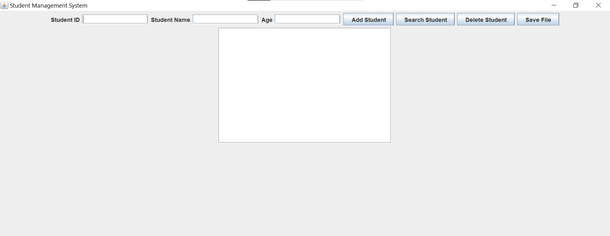
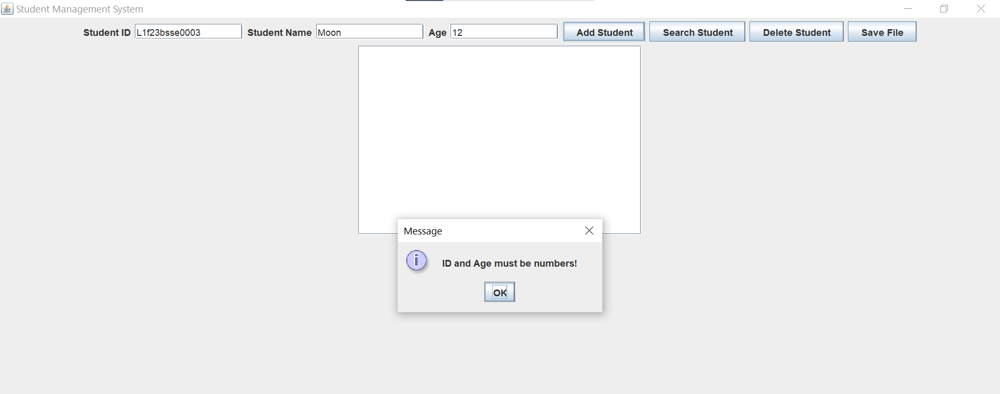
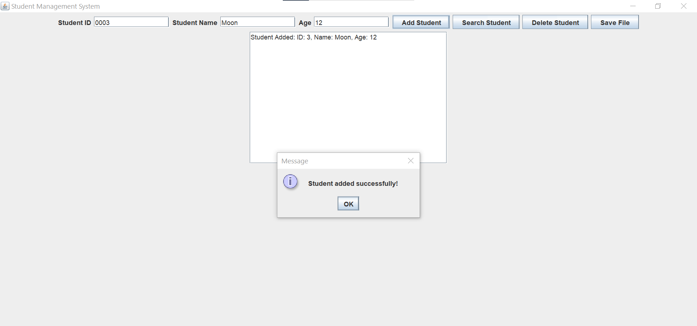
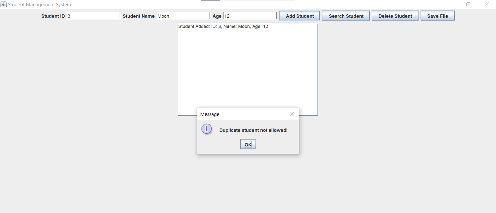
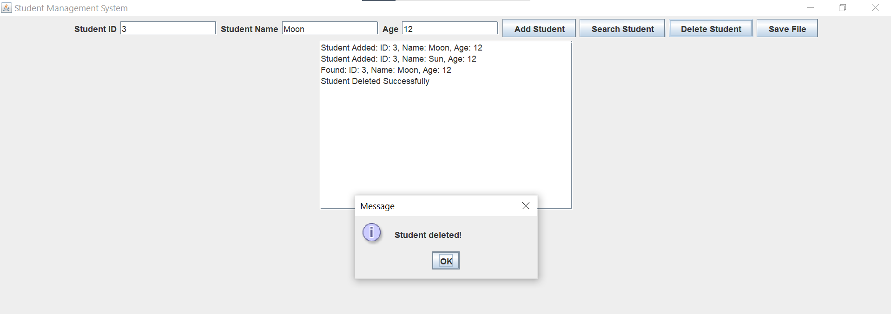

# Student Management System

## Project Overview

The Student Management System is a Java Swing-based desktop application developed for the SCD Lab Semester Project. The application allows users to manage student records through a graphical user interface (GUI).

This project demonstrates the practical implementation of Event Handling, Exception Handling, Code Refactoring, Unit Testing, and Git & GitHub.

---

## Features

### Student Management

* Add Student
* Search Student
* Delete Student
* Save Student Records to File

### Validation

* Prevents duplicate student records
* Validates numeric input for ID and Age
* Prevents empty student names
* Displays meaningful error messages

### File Handling

* Saves student records to a text file (`students.txt`)

### GUI

* User-friendly interface developed using Java Swing

---

## Technologies Used

* Java
* Java Swing
* File Handling
* Exception Handling
* JUnit (Unit Testing)
* Git & GitHub

---

## Concepts Implemented

### Event Handling

The application uses button click events to perform operations such as:

* Add Student
* Search Student
* Delete Student
* Save File

### Exception Handling

The system handles:

* Invalid numeric input
* Empty fields
* Duplicate student records
* File handling errors

### Code Refactoring

The project follows a modular structure using separate classes:

* Student.java
* StudentService.java
* StudentGUI.java
* Main.java

### Unit Testing

JUnit test cases are written for:

* Adding students
* Searching students
* Deleting students

### Git & GitHub

The project is maintained using Git and uploaded to GitHub with meaningful commit messages.

---

## Project Structure

```text
src
│
├── Student.java
├── StudentService.java
├── StudentGUI.java
└── Main.java
```

---

## How to Run

1. Open the project in IntelliJ IDEA.
2. Compile the project.
3. Run `Main.java`.
4. Use the GUI to manage student records.

---

## Sample Operations

### Add Student

Enter:

* Student ID
* Student Name
* Age

Click **Add Student**.

### Search Student

Enter Student ID and click **Search Student**.

### Delete Student

Enter Student ID and click **Delete Student**.

### Save Records

Click **Save File** to save all student data into `students.txt`.

---

## Screenshots


### Main Window


### Add Student Successfully



### Search Student



### Duplicate Student Validation



### Delete Student



### Save File



### Main Application Window

(Add the screenshot shown below)


---

## Author
Haroon
Semester Project - SCD Lab
